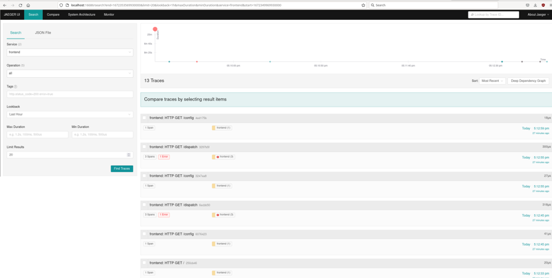

## Gopensearch

A lightweight single-process reimplementation of \[elastic|open\]search. Built with golang and sqlite3 as the backend data store, using the `fts5` and `json1` extensions.  

Aims to provide an ES-compatible implementation for constrained environments like SBCs / raspberry pis, dev-test scenarios and test pipelines, or anyone that just wants ES to 
start up quickly and use less memory. 

The full API is massive and most of it is unlikely to be implemented, though I imagine that there are plenty of people out there using only a small subset of its capabilities.

## Implementation Roadmap

Basic support for:
* Index and document creation
* Bulk doc creation
* Term/match queries
* Templates
  * Support for mapping date fields using ES format types like `epoch_millis` 
* Bool must/should compound queries 
* Multiple single-value aggregates
* Simple subaggregations
  * Limited to those that can be easily mapped to a single SQL statement (eg. single metric aggregate coupled with terms)

Near-term goals:
* Wild-card and explicit multiple index searching
* Improved date formatting
* Date histograms
* Documentation for what is supported and what isn't
* Improved integration tests 
* Artifact releases (docker image and binary build) direct to github

Future work:
* Indexing and storage optimizations in sqlite usage

Out of scope:
* Most things :) Clustering, sharding, painless lang, etc.

## Demo

For an example use of Gopensearch, there is a demo docker-compose file that brings up [Jaeger all-in-one](https://github.com/jaegertracing/jaeger/), the "HotRod"
trace generator, and a test instance of Gopensearch running in place of Elasticsearch. You can start it with:

```bash
$ docker-compose -f docker-compose-demo.yml up
Starting gopensearch_gopensearch_1 ... done
Starting gopensearch_jaeger-all-in-one_1 ... done
Starting gopensearch_hotrod_1            ... done
Attaching to gopensearch_gopensearch_1, gopensearch_jaeger-all-in-one_1, gopensearch_hotrod_1
gopensearch_1        | 2022/12/29 22:38:15 server.Config{DbLocation: "/tmp/test.db", ListenAddr: "0.0.0.0", Port: 9200, }
gopensearch_1        | 2022/12/29 22:38:15 Starting server on 0.0.0.0:9200
...

```

The indices created automatically can be viewed with:

```bash
$ curl http://localhost:9200/_cat/indices
green	open	jaeger-service-2022-12-29
green	open	jaeger-span-2022-12-29
```

The HotRod GUI will be available on http://localhost:8080, and the Jaeger UI available at http://localhost:16686:

{width=500}


## Building

For Linux amd64:

```bash
make
```

For ARM chipsets (32 and 64-bit):

```bash
make arm
```

### Support Matrix

Until I get around to properly documenting what works and what doesn't, 
you can get an idea for sorts of queries are supported by looking at 
the test cases in the `pkg/dsl` folder.

### Why make this?

I like running things on SBCs, often just to see if it can be done. And as I discovered, elasticsearch is not too happy running on a 1GB armv7 Orange Pi.

### Example use

```bash
$ curl -s -X "PUT" http://localhost:8080/newindex | jq
{
  "acknowledged": true,
  "shards_acknowledged": true,
  "index": "newindex"
}
```


```bash
$ curl -s -X "POST" http://localhost:8080/newindex/_create -d '{"hello": "world"}' | jq
{
  "_index": "newindex",
  "_id": 2,
  "_version": 1,
  "result": "created"
}

```

```bash
$ curl -s -X "POST" http://localhost:8080/newindex/_search -d '{"query": { "term": {"hello": "world"} }' | jq
[
  {
    "id": 1,
    "_source": {
      "hello": "world"
    }
  }
]
```

`examples` has some more example use cases.
